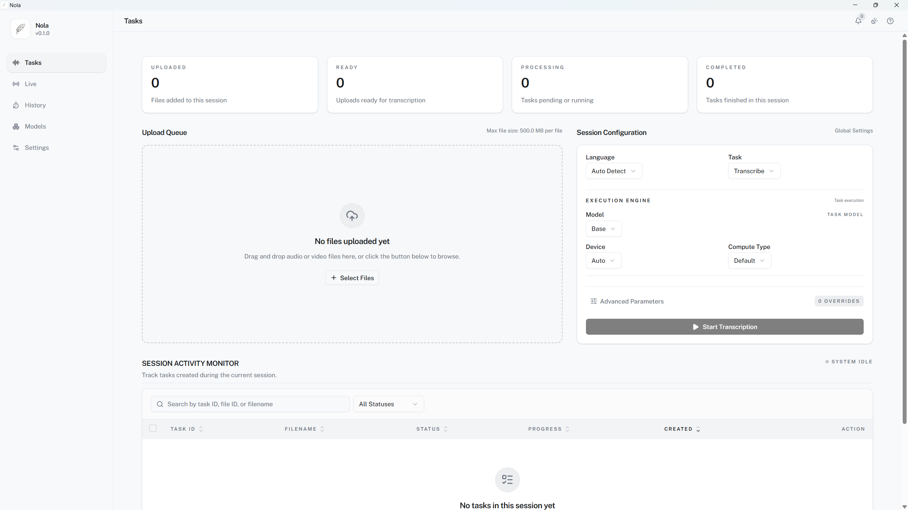

<div align="center">

# Nola

[English](./README.md) · [简体中文](./README.zh-CN.md)

Local-first speech transcription and subtitle processing application

FastAPI, React, SQLite, Faster-Whisper, WhisperStreaming, and Tauri stack; offline file transcription, realtime audio transcription, model management, task history, and subtitle export.



[Transcription flow demo](./docs/media/nola-task-transcription-flow.gif)

[Client and desktop docs](./app/README.md) · [Backend docs](./core/README.md) · [Release and deployment docs](./docs/README.en.md)

</div>

## Core Features

- File transcription: audio/video upload, task creation, progress tracking, cancellation, retry, record deletion
- Batch processing: multi-file queue, batch task actions, batch subtitle export
- Realtime transcription: microphone input, system audio input, WebSocket audio stream, realtime text output
- Model management: model list, model download, download progress, cache state, default model selection, model deletion
- History management: transcription tasks, uploaded files, realtime session records
- Subtitle export: SRT, VTT, TXT, ASS, single-item export, batch ZIP export
- Configuration: backend connection target, transcription defaults, realtime transcription defaults, export defaults, model storage settings
- Desktop support: Tauri desktop client, Windows audio device enumeration, WASAPI audio capture, remote backend connection

## Requirements

- Python 3.10+
- Poetry 2.x
- GNU Make
- Node.js 20.19+, 22.13+, or 24+
- pnpm 10+
- Rust stable
- Windows 10/11 for desktop audio capture and Windows installer builds
- CPU inference: no CUDA
- NVIDIA GPU inference: CUDA 12.x, cuBLAS for CUDA 12, and cuDNN 9 for CUDA 12

## Quick Start

Run long-lived services in separate terminals.

```bash
# Backend and frontend dependency installation
make install
```

```bash
# FastAPI backend service startup
make api
```

```text
API address: http://127.0.0.1:8000
API docs: http://127.0.0.1:8000/docs
```

```bash
# Background transcription worker startup
make worker
```

```bash
# Web frontend development server startup
make app-dev
```

```text
Frontend address: http://localhost:5173
```

```bash
# Tauri desktop development client startup
make desktop-dev
```

```text
Default desktop backend: http://127.0.0.1:8000
Remote backend setup: app/README.md
```

## Running Modes

- Local Web: backend API, Worker, and Web frontend on one development machine
- Local Desktop: Tauri desktop client with local backend
- Desktop With Remote Backend: local desktop audio capture with configured remote backend
- Backend Deployment: API service and Worker processes for Web or desktop clients

## Current Limits

- Maximum file size: 500 MB
- Upload formats: mp3, wav, flac, m4a, ogg, webm, aac, mp4, wma
- Export formats: srt, vtt, txt, ass
- Desktop audio capture: Windows 10/11
- Remote/public deployment boundary: trusted network or external authentication layer required

## Project Shape

Backend and client workspaces:

- `core/`: FastAPI API, transcription worker, SQLite data, model cache, realtime transcription runtime
- `app/`: React Web frontend, Tauri desktop client, realtime audio capture UI

Root README: short project overview. Detailed client and backend docs: `app/README.md` and `core/README.md`.

## Development Commands

```bash
# Frontend, backend, and desktop lint checks
make lint

# TypeScript and Mypy type checks
make typecheck

# Frontend, backend, and desktop tests
make test

# Full local quality check
make check

# Frontend type generation from backend OpenAPI schema
make app-gen-types

# Windows desktop installer build
make desktop-build-windows
```

## Documentation

- `docs/README.en.md`: release automation, release artifacts, Windows packaging, Docker, and Web deployment
- `app/README.md`: client workspace setup, desktop client, connection settings
- `core/README.md`: backend workspace setup, API, worker, deployment settings
- `app/AI_INSTRUCTIONS.md`: frontend workspace structure, modules, command reference
- `core/AI_INSTRUCTIONS.md`: backend workspace structure, modules, API reference

## License

MIT License: [LICENSE](./LICENSE)
