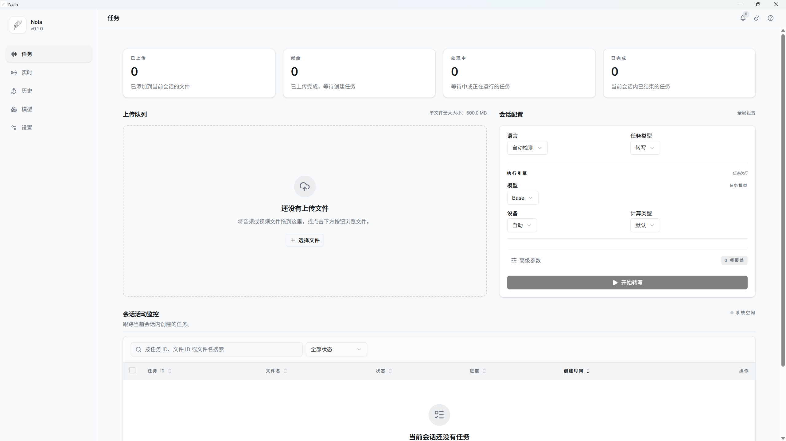

<div align="center">

# Nola

[English](./README.md) · [简体中文](./README.zh-CN.md)

本地优先的语音转写与字幕处理应用

FastAPI、React、SQLite、Faster-Whisper、WhisperStreaming、Tauri 技术栈；离线文件转写、实时音频转写、模型管理、任务历史、字幕导出。



[转录流程演示](./docs/media/nola-task-transcription-flow.gif)

</div>

## 核心能力

- 文件转写：音频/视频上传、任务创建、进度跟踪、取消、重试、记录删除
- 批量处理：多文件队列、批量任务操作、批量字幕导出
- 实时转写：麦克风输入、系统音频输入、WebSocket 音频流、实时文本输出
- 模型管理：模型列表、模型下载、下载进度、缓存状态、默认模型选择、模型删除
- 历史管理：转写任务、上传文件、实时会话记录
- 字幕导出：SRT、VTT、TXT、ASS、单项导出、批量 ZIP 导出
- 配置管理：转写默认值、实时转写默认值、导出默认值、模型存储设置
- 桌面能力：Tauri 桌面客户端、Windows 音频设备枚举、WASAPI 音频采集

## 技术细节

### 转写引擎

当前离线转写引擎：Faster-Whisper。

运行时管理：统一模型注册表、模型缓存、任务运行配置。
前端模型页面：下载状态、缓存状态、默认模型选择。
扩展边界：后续本地或远程转写后端接入。

### 模型注册表

当前模型注册表：三类 Faster-Whisper 模型。

- 多语言模型：Tiny、Base、Small、Medium、Large V1、Large V2、Large V3、Large V3 Turbo
- 英文专用模型：Tiny English、Base English、Small English、Medium English
- Distil Whisper 模型：Distil Small English、Distil Medium English、Distil Large V2、Distil Large V3、Distil Large V3.5

模型管理页面：下载状态、缓存状态、下载进度、默认模型选择、缓存删除。

### 实时转写

实时转写运行时：WhisperStreaming LocalAgreement 行为。
音频传输：16 kHz mono PCM16LE 帧；WebSocket JSON 元数据与二进制音频载荷。

结果事件类别：

- `preview`：当前假设文本
- `committed_partial`：LocalAgreement 稳定片段
- `final`：实时会话历史中的最终分段

### WhisperStreaming 适配

Nola 实时模块范围：本地转写所需的算法状态、缓冲区裁剪、重复文本去重、分段提交、最终结果持久化边界。

上游排除路径：WhisperStreaming CLI、TCP server、自动模型下载、OpenAI API、MLX、`whisper_timestamped`。

完整模块说明：[`core/nola/application/live/realtime/whisper_streaming/README.md`](core/nola/application/live/realtime/whisper_streaming/README.md)。

### 当前限制

- 单文件大小上限：500 MB
- 上传格式：mp3, wav, flac, m4a, ogg, webm, aac, mp4, wma
- 导出格式：srt, vtt, txt, ass
- 单次批量任务请求上限：500 个任务 ID
- 单次批量文件请求上限：500 个文件 ID
- 后端默认地址：`127.0.0.1:8000`
- 前端开发地址：`localhost:5173`

## 快速启动

前置环境：`环境要求` 章节。

```bash
# 后端与前端依赖安装
make install
```

```bash
# FastAPI 后端服务启动
make api
```

```text
API 地址：http://127.0.0.1:8000
API 文档：http://127.0.0.1:8000/docs
```

```bash
# 后台转写 Worker 启动
make worker
```

```bash
# Web 前端开发服务启动
make app-dev
```

```text
前端地址：http://localhost:5173
```

```bash
# Tauri 桌面开发客户端启动
make desktop-dev
```

```text
桌面客户端默认后端：http://127.0.0.1:8000
```

## 环境要求

- Python 3.10+
- Poetry 2.x
- Node.js 20.19+、22.13+ 或 24+
- pnpm 10+
- Rust stable
- Windows 10/11（桌面音频采集与 Windows 安装包构建）
- CPU 推理：无需 CUDA
- NVIDIA GPU 推理：CUDA 12.x、cuBLAS for CUDA 12、cuDNN 9 for CUDA 12

## 开发命令

```bash
# 前端、后端、桌面 lint 检查
make lint

# TypeScript 与 Mypy 类型检查
make typecheck

# 前端、后端、桌面测试
make test

# 本地完整质量检查
make check

# 后端 OpenAPI schema 对应的前端类型生成
make app-gen-types

# Windows 桌面安装包构建
make desktop-build-windows
```

## 相关文档

- `app/README.md`：前端、桌面客户端、实时音频客户端
- `core/README.md`：后端 API、Worker、模型、数据与测试
- `app/AI_INSTRUCTIONS.md`：前端工作区结构、模块与命令说明
- `core/AI_INSTRUCTIONS.md`：后端工作区结构、模块与 API 说明
